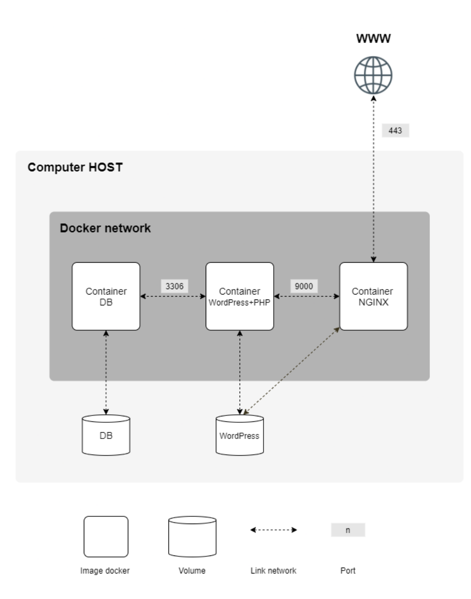

# Inception Project

https://github.com/Redaa0/inception/blob/main/inception1.mkv

This project, part of the 42 curriculum, involves setting up a comprehensive infrastructure using Docker. The goal is to containerize several services (NGINX, WordPress, MariaDB) and orchestrate them using Docker Compose, all while adhering to strict security and system administration best practices.

## 🚀 Table of Contents

- [About The Project](#-about-the-project)
- [Architecture Diagram](#-architecture-diagram)
- [Technologies Used](#-technologies-used)
- [Project Structure](#-project-structure)
- [Configuration Deep Dive](#-configuration-deep-dive)
  - [Docker Compose](#docker-compose)
  - [NGINX](#nginx)
  - [WordPress](#wordpress)
  - [MariaDB](#mariadb)
  - [Adminer (Bonus)](#adminer-bonus)
- [Getting Started](#-getting-started)
  - [Prerequisites](#prerequisites)
  - [Installation](#installation)
- [Makefile Commands](#-makefile-commands)

## 📖 About The Project

The "Inception" project challenges us to go beyond a single container and build a multi-service application. It demonstrates a practical understanding of containerization, networking, and system administration in a sandboxed virtual machine environment.

Key requirements included:
* **Custom Docker Images:** Building NGINX, WordPress, and MariaDB images from scratch using `Debian:Bullseye` as a base.
* **Persistent Data:** Using Docker volumes to ensure that website files and database data persist even when containers are removed.
* **Secure Networking:** Creating a dedicated bridge network for inter-container communication, with NGINX as the sole entry point to the outside world via port 443.
* **Security:** Implementing TLSv1.3 encryption, using environment variables for credentials (no hardcoded passwords), and setting up a secure database.

## 🏗️ Architecture Diagram

The infrastructure consists of three core services and one bonus service, all communicating over a private Docker network. NGINX acts as a reverse proxy, directing traffic to the appropriate service.





## 🛠️ Technologies Used

* [**Docker**](https://www.docker.com/): For containerizing applications.
* [**Docker Compose**](https://docs.docker.com/compose/): For defining and running multi-container Docker applications.
* [**NGINX**](https://www.nginx.com/): As a reverse proxy and web server with TLS encryption.
* [**WordPress**](https://wordpress.org/): As the Content Management System (CMS), with PHP-FPM.
* [**MariaDB**](https://mariadb.org/): As the relational database for WordPress.
* [**Adminer**](https://www.adminer.org/): A database management tool (bonus part).
* [**Debian Bullseye**](https://www.debian.org/): The base OS for all Docker images.
* [**OpenSSL**](https://www.openssl.org/): For generating self-signed TLS certificates.
* [**WP-CLI**](https://wp-cli.org/): The command-line interface for WordPress.

## 📁 Project Structure

The project is organized with a `srcs` directory containing the `docker-compose.yml`, `.env` file, and a `requirements` folder for each service's configuration.

```
.
├── Makefile
└── srcs
    ├── docker-compose.yml
    ├── .env
    └── requirements
        ├── bonus
        │   └── adminer
        │       └── Dockerfile
        ├── mariadb
        │   ├── Dockerfile
        │   └── script.sh
        ├── nginx
        │   ├── default
        │   └── Dockerfile
        └── wordpress
            ├── Dockerfile
            └── script.sh
```

## 🔧 Configuration Deep Dive

### Docker Compose

The `docker-compose.yml` file orchestrates the entire application stack:
* **`services`**: Defines the four containers: `nginx`, `wordpress`, `mariadb`, and `adminer`.
* **`build`**: Specifies the path to the Dockerfile for each service, ensuring they are built from scratch.
* **`restart: always`**: Ensures containers automatically restart after a crash.
* **`networks`**: Connects all services to a custom bridge network named `network`, enabling communication by service name.
* **`volumes`**: Mounts host directories (`/home/rmoutaou/data/*`) into the containers for persistent data storage.
* **`env_file`**: Loads environment variables from the `.env` file to avoid hardcoding credentials.
* **`depends_on`**: Controls the startup order. `wordpress` waits for `mariadb` to be healthy before starting.
* **`healthcheck`**: The `mariadb` service includes a health check to verify that the database is ready to accept connections.

### NGINX

* **`Dockerfile`**: Installs NGINX and OpenSSL, then generates a self-signed TLS certificate for `rmoutaou.42.fr`.
* **`nginx_default.conf`**:
    * Listens on port `443` with SSL enabled (TLSv1.3).
    * Acts as a reverse proxy, forwarding requests for PHP files to the `wordpress` container on port `9000` via FastCGI.
    * Serves static files directly.
    * A second server block listens on `8080` to proxy requests for `/adminer.php` to the `adminer` service.

### WordPress

* **`Dockerfile`**: Installs `php-fpm`, the `php-mysql` extension, and `curl`.
* **`wp_script.sh`**:
    1.  Configures PHP-FPM to listen on port `9000`.
    2.  Downloads and installs `wp-cli` (WordPress Command-Line Interface).
    3.  Downloads WordPress core files.
    4.  Uses `sed` to dynamically populate `wp-config.php` with database credentials from environment variables.
    5.  Runs `wp core install` to set up the site, create an admin user, and a secondary user.
    6.  Starts the `php-fpm` process in the foreground.

### MariaDB

* **`Dockerfile`**: Installs `mariadb-server`.
* **`mariadb_script.sh`**:
    1.  Configures MariaDB to accept connections from any IP address within the Docker network.
    2.  Initializes the database service.
    3.  Executes SQL commands to create the database and user specified in the `.env` file.
    4.  Secures the `root` user and flushes privileges.
    5.  Shuts down the temporary server and restarts it in safe mode (`mariadbd-safe`) to run as the main container process.

### Adminer (Bonus)

* **`Dockerfile`**: Installs Apache, PHP, and downloads the Adminer single-file application. It configures Apache to listen on port `8080`, which is then accessed via the NGINX reverse proxy.

## 🚀 Getting Started

Follow these steps to get the project up and running in your virtual machine.

### Prerequisites

* A Linux Virtual Machine.
* Docker and Docker Compose installed.
* `sudo` privileges.

### Installation

1.  **Clone the repository:**
    ```sh
    git clone https://github.com/Redaa0/Inception-new.git
    cd inception
    ```

2.  **Create an environment file:**
    Create a `.env` file inside the `srcs` directory and populate it with your desired credentials.
    ```env
    # srcs/.env

    # Domain
    DOMAIN_NAME=rmoutaou.42.fr

    # MariaDB Credentials
    MYSQL_DATABASE=wordpress_db
    MYSQL_USER=user
    MYSQL_PASSWORD=secure_password
    MYSQL_ROOT_PASSWORD=super_secure_root_password

    # WordPress Credentials
    WORDPRESS_TITLE="Inception Site"
    WP_ADMIN_USER=adminuser
    WP_ADMIN_PASSWORD=admin_pass
    WP_ADMIN_EMAIL=admin@example.com
    WP_USER=authoruser
    WP_USER_EMAIL=author@example.com
    WP_USER_PASSWORD=author_pass
    ```

3.  **Run the project:**
    Use the `Makefile` to set up the environment and launch the containers.
    ```sh
    make
    ```
    This command will:
    * Create the necessary data directories on the host.
    * Add your local domain to `/etc/hosts`.
    * Build the Docker images and start the services.

4.  **Access the site:**
    Open your browser and navigate to `https://rmoutaou.42.fr`.

## ⚙️ Makefile Commands

* `make all` or `make`: Sets up host directories, modifies `/etc/hosts`, and builds/starts the containers.
* `make clean`: Stops and removes the containers and network. Volumes are preserved.
* `make fclean`: Executes `clean` and additionally removes all Docker images, volumes, and build cache. It also cleans the host data directories. **Warning: This is destructive.**
* `make re`: A shortcut for `fclean` followed by `all`. Rebuilds everything from scratch.
